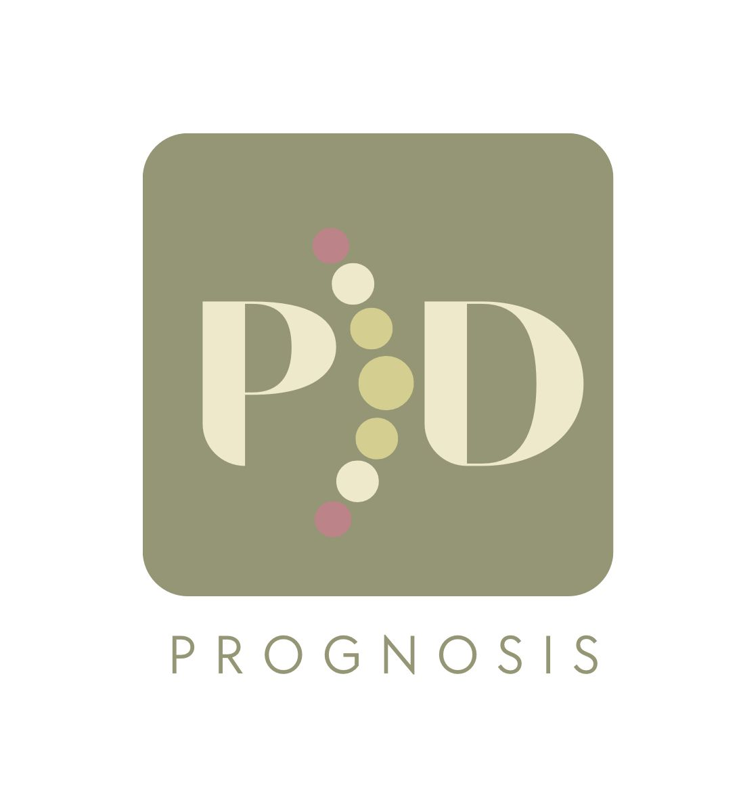

# PDPrognosis



## Introduction
PDPrognosis is a graduation project that offers a user-friendly platform designed to streamline the management of Parkinson's disease for doctors. It provides time-saving tools and comprehensive insights into patients' protein and peptide profiles, aiding doctors in making informed decisions with ease, and ensures all relevant information is readily accessible for effective patient care.

## Technology
- Digital Ocean hosting services.
- Visual Studio Code
- Python
- HTML
- CSS
- JavaScript

---

## 🚀 Launching Instructions

Follow these simple steps to launch and experience the project:

### 1️⃣ Clone the Repository
Start by cloning this repository to your local machine:
```bash
git clone https://github.com/your-username/your-repo-name.git
cd your-repo-name
